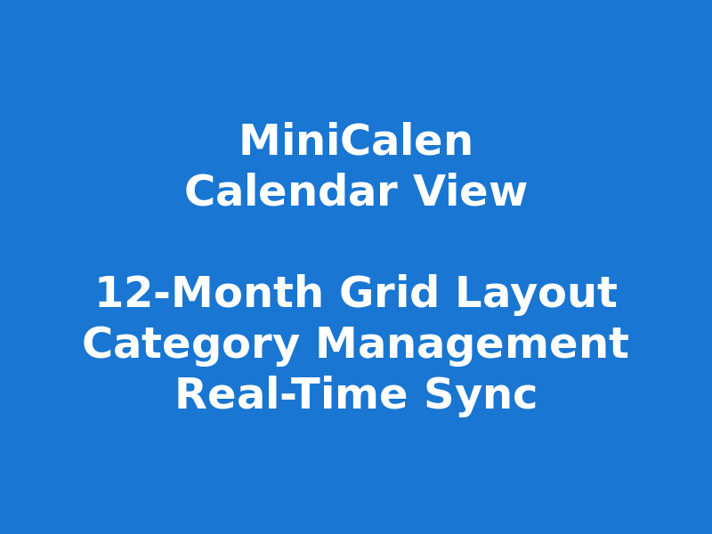

# MiniCalen

A lightweight, collaborative calendar application with real-time synchronization and user authentication.



## ✨ Features

### 📅 **Calendar Management**
- **Year View**: 12-month grid layout for complete year overview
- **Interactive Selection**: Click dates to assign categories and text labels
- **Today Highlighting**: Current date automatically highlighted
- **Smart Navigation**: Seamless month-to-month date handling

### 🎨 **Category System**
- **Foreground Categories**: Color-coded backgrounds (Important, Work, Personal) with customizable hex colors
- **Text Labels**: Symbol-based tags (e.g., "Holiday [H]") that overlay on dates
- **Multiple Categories**: Assign multiple labels to any date
- **Visual Controls**: Toggle categories on/off with checkboxes

### 🔐 **Authentication & User Management**
- **Anonymous Sessions**: Start creating calendars immediately without signup
- **User Accounts**: Email/password authentication powered by Better-Auth
- **Session Ownership**: Claim anonymous calendars by signing in
- **My Calendars Dashboard**: Manage all your calendars from one place


### 💾 **Session & Sharing**
- **Persistent Storage**: SQLite database with automatic state saving
- **Shareable URLs**: Collaborate via unique session links
- **Permission Levels**: Owner, editor, and viewer access control
- **State Restoration**: Complete calendar state preserved across reloads

### 🔄 **Real-Time Collaboration**
- **WebSocket Sync**: Instant updates across all connected clients
- **Multi-User Support**: Multiple users editing simultaneously with permissions
- **Cross-Browser**: WebSocket fallback for Firefox and all major browsers
- **Authenticated Connections**: Socket.IO with session-based authentication

### 🎛️ **User Interface**
- **Material-UI Design**: Modern, responsive interface
- **Sidebar Controls**: Category management with visual feedback
- **4-Column Grid**: Optimized responsive layout

### 🔧 **Technical Stack**
- **Frontend**: React 18 + TypeScript + Vite + Material-UI
- **Backend**: Node.js + Express + Socket.IO + Better-Auth
- **Database**: SQLite with Drizzle ORM
- **Deployment**: Docker + GitHub Actions CI/CD
- **Architecture**: npm workspace monorepo

## 📚 Documentation

Detailed documentation available in the `docs/` folder:
- [Authentication Guide](docs/AUTHENTICATION.md) - User authentication and session management
- [Docker Deployment](DOCKER.md) - Container deployment instructions
- [CI/CD Pipeline](CI-CD.md) - Automated build and deployment
- [Logging](LOGGING.md) - Application logging configuration

## 📦 Packages

This is a monorepo containing two independent packages:

- **[@minicalen/frontend](./packages/frontend)** - React frontend application
- **[@minicalen/server](./packages/server)** - Node.js backend server

## 🚀 Quick Start

### Development

```bash
# Install all dependencies
npm install

# Start both frontend and server in development mode
npm run dev:all

# Or start them separately:
npm run dev:server  # Start backend server
npm run dev         # Start frontend application
```

### Production Build

```bash
# Build both packages
npm run build

# Or build them separately:
npm run build:frontend
npm run build:server

# Start production server
npm run start
```

### Docker Deployment

```bash
# Using Docker Compose (recommended)
docker-compose up -d

# Or build and run manually
docker run -d --name minicalen-server \
  -p 3001:3001 \
  -v $(pwd)/data:/app/data \
  -v $(pwd)/logs:/app/logs \
  -e BETTER_AUTH_SECRET=your-secret-key \
  minicalen-server
```

**Environment Variables**:
- `BETTER_AUTH_SECRET` - Required for authentication (min 32 characters)
- `DATABASE_URL` - Optional SQLite database path
- `ALLOWED_ORIGINS` - CORS origins for production

See [DOCKER.md](DOCKER.md) for complete deployment guide.

## 🏗️ Architecture

```
minicalen/
├── packages/
│   ├── frontend/          # React + TypeScript + Vite
│   │   ├── src/
│   │   │   ├── auth/      # Better-Auth client
│   │   │   ├── components/ # React components
│   │   │   ├── contexts/  # React contexts
│   │   │   └── hooks/     # Custom hooks
│   │   └── dist/          # Production build
│   └── server/            # Node.js + Express + Socket.IO
│       ├── src/
│       │   ├── auth/      # Authentication middleware
│       │   ├── db/        # Drizzle ORM schemas
│       │   └── routes/    # API endpoints
│       ├── data/          # SQLite database
│       └── logs/          # Application logs
├── docs/                  # Documentation
│   ├── AUTHENTICATION.md
│   └── screenshots/
└── docker-compose.yml     # Container orchestration
```

## 🛠️ Development Workflow

Each package is independently managed with its own:
- Dependencies (`package.json`)
- Build configuration
- TypeScript configuration
- ESLint configuration
- README documentation

### Working with Packages

```bash
# Install dependencies for a specific package
npm install --workspace=@minicalen/frontend
npm install --workspace=@minicalen/server

# Run scripts in a specific package
npm run build --workspace=@minicalen/frontend
npm run dev --workspace=@minicalen/server

# Add dependencies to a specific package
npm install react --workspace=@minicalen/frontend
npm install express --workspace=@minicalen/server
```

## 🌐 Environment Configuration

**Frontend** (`packages/frontend/.env`):
- `VITE_API_URL` - Backend API URL (default: `http://localhost:3001`)
- `VITE_WS_URL` - WebSocket URL (auto-configured in development)

**Backend** (`packages/server/.env`):
- `BETTER_AUTH_SECRET` - Auth secret key (required, min 32 chars)
- `DATABASE_URL` - SQLite database path (default: `./data/minicalen.db`)
- `PORT` - Server port (default: `3001`)
- `ALLOWED_ORIGINS` - CORS origins for production

See [docs/AUTHENTICATION.md](docs/AUTHENTICATION.md) for authentication setup details.

## 🔄 CI/CD & Deployment

### Automated Docker Builds

Create a release tag ending with `-RELEASE` to trigger automated builds:

```bash
git tag v1.0.0-RELEASE
git push origin v1.0.0-RELEASE
```

GitHub Actions will build and publish Docker images for both frontend and server to Docker Hub.

**Required GitHub Secrets**: `DOCKER_USERNAME`, `DOCKER_PASSWORD`

For complete CI/CD documentation, see [CI-CD.md](CI-CD.md).

## 🔧 Available Scripts

```bash
# Development
npm run dev:all              # Start both frontend and backend
npm run dev                  # Start frontend only
npm run dev:server           # Start backend only

# Building
npm run build                # Build both packages
npm run build:frontend       # Build frontend only
npm run build:server         # Build server only

# Docker
npm run build:frontend:docker  # Build frontend Docker image
npm run build:server:docker    # Build server Docker image
```

## 📄 License

MIT License - See individual package READMEs for details.
